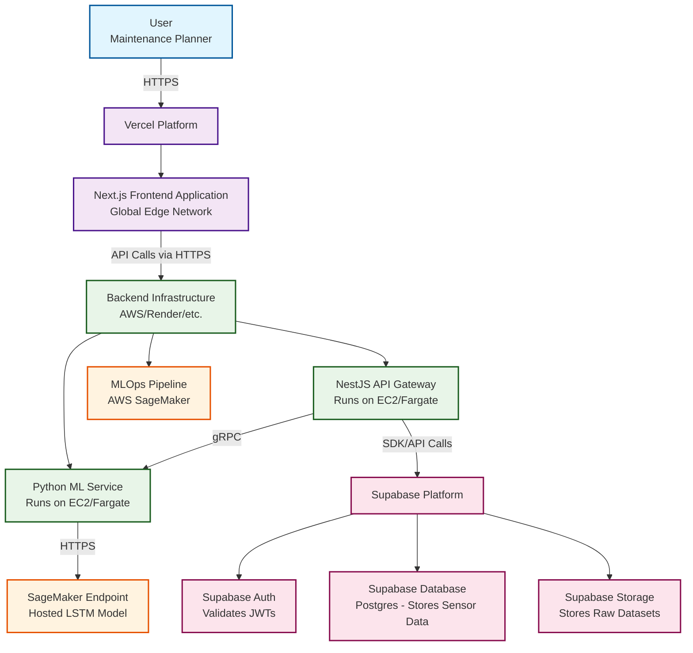

# **System Architecture and Requirements Specification: Predictive Maintenance Dashboard for Aircraft Components**

## **Part 1: General Project Summary & System Architecture**

### **Section 1: Introduction and Strategic Context**

#### **1.1. The Business Imperative for Predictive Maintenance (PdM) in Aeronautics**

The aviation industry operates under stringent safety regulations and immense financial pressures, where asset reliability and operational efficiency are paramount. Historically, maintenance strategies have been dominated by two paradigms: reactive maintenance (fixing components after they fail) and preventive maintenance (servicing components on a fixed schedule, regardless of their actual condition). While these approaches have maintained safety standards, they are economically suboptimal. Reactive maintenance leads to unplanned downtime, flight cancellations, and costly emergency repairs, while preventive maintenance often results in the premature replacement of perfectly functional components, incurring unnecessary expense.

Predictive Maintenance (PdM) represents a paradigm shift, moving from a schedule-based or failure-based approach to a condition-based strategy.1 It is a proactive methodology that leverages real-time data collection, advanced analytics, and machine learning to monitor the health of in-service equipment and predict potential failures before they occur.2 By analyzing data from a multitude of sensors—monitoring parameters like temperature, pressure, and vibration—PdM systems can identify subtle patterns and anomalies that signal performance degradation.1

The implementation of PdM in aviation yields several transformative benefits. Firstly, it drastically reduces unplanned downtime by anticipating failures, allowing maintenance to be scheduled during planned service windows.1 Secondly, it optimizes maintenance costs by ensuring that components are serviced or replaced only when necessary, thereby extending the useful life of assets and minimizing waste.2 Most importantly, it enhances operational safety by identifying potential risks before they can escalate into critical incidents, ensuring the integrity of the aircraft and the safety of passengers and crew.1 This project is designed to build a tool that embodies these principles, providing a tangible solution to a critical industry challenge.

#### **1.2. Project Vision: A Fleet-Wide Health Monitoring and RUL Prediction Dashboard**

The vision for this project is to create a full-stack web application that provides a comprehensive, data-driven dashboard for monitoring the health of a fleet of aircraft turbofan engines, predicting the Remaining Useful Life (RUL) of critical components, and generating proactive maintenance alerts.

This system is designed for the modern aviation maintenance planner and fleet operations manager. This user persona is responsible for maximizing fleet availability while minimizing maintenance costs and ensuring absolute safety compliance. They require a tool that transforms complex sensor data into clear, actionable intelligence, enabling them to move from reactive problem-solving to proactive, data-informed decision-making. The dashboard will serve as their central hub for understanding asset health, prioritizing maintenance tasks, and optimizing the logistics of their entire maintenance, repair, and overhaul (MRO) operations.

#### **1.3. Key Performance Indicators (KPIs) for Project Success**

The success of this project will be measured against a set of well-defined technical and operational KPIs, ensuring that both the machine learning model and the supporting application meet rigorous standards of quality and performance.

- **Model Performance:**
  - **Root Mean Squared Error (RMSE):** The primary metric for the RUL prediction model will be RMSE, which quantifies the average magnitude of the error between predicted and actual RUL in terms of operational cycles. A lower RMSE indicates higher model accuracy.4
  - **Prognostics Scoring Function:** In addition to RMSE, the model will be evaluated using the asymmetric scoring function defined in the PHM08 data challenge. This function applies a heavier penalty to late predictions (underestimating RUL), as these scenarios pose a greater safety risk in a real-world operational context than early predictions (overestimating RUL).4
- **System Performance:**
  - **API Response Time:** All primary API endpoints must have a 95th percentile (P95) response time of less than 200 ms under typical load.
  - **Dashboard Load Time:** The initial load time for the main dashboard view should be under 3 seconds to ensure a fluid user experience.
  - **Model Inference Latency:** The time taken for the machine learning model to return a prediction from a given sequence of sensor data should be consistently below 100 ms.
- **Operational Reliability:**
  - **System Uptime:** The deployed application will target an uptime of greater than 99.9%, ensuring high availability for operational users.
  - **CI/CD Pipeline Success Rate:** The automated build, test, and deployment pipelines for both the application and the ML model must maintain a success rate of over 95%.

### **Section 2: End-to-End System Architecture**

#### **2.1. High-Level Architectural Blueprint**

The system is designed using a modern, hybrid architecture that combines the rapid development capabilities of a Backend-as-a-Service (BaaS) platform with the power of custom microservices for specialized, computationally intensive tasks. This approach leverages the best tool for each job, creating a scalable, maintainable, and efficient system.

The architecture consists of a Next.js frontend deployed on Vercel for optimal performance and user experience. The backend is split into two parts: a Supabase project provides the foundational services (database, authentication, storage), while a custom NestJS API Gateway and a Python ML service handle the core business logic and predictive modeling. This separation allows the bulk of standard backend functionality to be managed by Supabase, freeing up development to focus on the unique, high-value components of the application. The machine learning lifecycle remains on AWS, utilizing the mature and powerful Amazon SageMaker ecosystem for model training and deployment.

The following diagram illustrates the high-level hybrid system architecture:

#### **2.2. Component Responsibilities and Interactions**

- **Frontend (Next.js on Vercel):** This is the client-facing application that renders the predictive maintenance dashboard. It is deployed on Vercel to leverage its global edge network for low latency and seamless CI/CD. It communicates exclusively with the Backend API Gateway.
- **Backend API Gateway (NestJS):** This service acts as the central orchestrator. It handles all incoming client requests, validates JWTs issued by Supabase, implements core business logic, and coordinates communication with both the Supabase backend and the Python ML service. It is hosted on a flexible cloud compute service like AWS Fargate or EC2.
- **Backend ML Service (Python/FastAPI):** This is a lightweight, specialized microservice whose only purpose is to serve the trained machine learning model. It exposes a single, highly optimized endpoint that accepts a sequence of engine sensor data and returns a predicted RUL value.
- **Backend-as-a-Service (Supabase):** Supabase provides the foundational backend infrastructure.
  - **Supabase Database:** A managed Postgres database stores all historical sensor data and application state.
  - **Supabase Auth:** Manages user authentication, including sign-ups, logins, and issuing JWTs.
  - **Supabase Storage:** An S3-compatible object store holds the raw C-MAPSS dataset and the trained model artifacts.
- **MLOps Platform (AWS SageMaker):** AWS provides the specialized infrastructure for the machine learning lifecycle. This includes Amazon SageMaker for orchestrating model training, evaluation, deployment, and hosting via a secure endpoint.

#### **2.3. Technology Stack Rationale**

The technology stack is carefully selected to leverage best-in-class solutions for each layer of the application, prioritizing developer experience, performance, and scalability.

- **Frontend (Next.js on Vercel):** Next.js is the industry standard for professional React applications, providing server-side rendering (SSR) and a superior developer experience. Deploying on Vercel offers a seamless Git-based workflow, automatic deployments, and distribution on a global edge network for optimal performance.6
- **Backend API Gateway (NestJS):** As a progressive Node.js framework, NestJS provides a highly structured architecture ideal for building a robust and maintainable API gateway that can orchestrate complex workflows between other services.7
- **Backend ML Service (Python with FastAPI):** Python is the de facto language for data science. FastAPI is a modern, high-performance web framework for building efficient, well-documented ML inference services.9
- **Data Science (Python with TensorFlow/Keras):** TensorFlow and its Keras API provide a comprehensive and powerful ecosystem for building, training, and deploying the LSTM neural network required for this project.5
- **Hybrid Cloud (Supabase, AWS, Vercel):** This hybrid approach is a strategic choice.
  - **Supabase** is used as a BaaS to accelerate development by providing managed, out-of-the-box solutions for the database, authentication, and storage.
  - **AWS** is used for its specialized, industry-leading MLOps capabilities. Amazon SageMaker is a powerful, managed platform that handles the entire ML lifecycle, a task for which Supabase is not designed.12
  - **Vercel** is the premier platform for hosting Next.js applications, providing unmatched performance and developer experience for the frontend.

#### **2.4. Data Flow Diagram**

The end-to-end flow of data is orchestrated across the hybrid platform.

1. **Data Storage:** The raw NASA C-MAPSS dataset is stored in **Supabase Storage**. Historical sensor data is loaded into the **Supabase Postgres database**.
2. **Model Training (MLOps Pipeline):** The AWS SageMaker Pipeline is triggered. It pulls the raw dataset from **Supabase Storage**, processes the data, trains the LSTM model, evaluates its performance, and saves the final model artifact back to **Supabase Storage**. The model is then registered in the SageMaker Model Registry.
3. **Model Deployment:** The approved model is deployed to a scalable, secure AWS SageMaker Endpoint for real-time inference.
4. **Prediction Request:** A user on the **Next.js frontend on Vercel** selects an engine. The frontend sends a request to the NestJS API Gateway (e.g., POST /api/engines/1/predict).
5. **Service Orchestration:** The NestJS Gateway receives the request and validates the user's JWT (issued by Supabase). It then performs two parallel actions:
   - It queries the **Supabase Postgres database** using the Supabase client SDK to fetch the engine's historical sensor data.
   - It forwards the most recent sequence of sensor data to the Python/FastAPI ML service via an internal gRPC call.
6. **Inference:** The FastAPI service makes a secure HTTPS call to the AWS SageMaker Endpoint, passing the sensor data.
7. **Prediction Response:** The SageMaker Endpoint returns the RUL prediction. This value is passed from FastAPI back to the NestJS Gateway.
8. **Data Visualization:** The NestJS Gateway combines the RUL prediction with the historical data fetched from **Supabase** into a single JSON payload and sends it back to the Next.js frontend. The UI is then dynamically updated.

### **Section 3: Core Features and User Epics**

The project's features are defined through user-centric epics and stories, ensuring that development is aligned with the needs of the target maintenance planner persona.

#### **3.1. Epic 1: Fleet Health Assessment**

**As a Maintenance Planner, I want to see a high-level overview of my entire fleet of engines so that I can quickly identify which assets are most at risk.**

- **User Story 1.1:** The dashboard must display a sortable and filterable table of all engines in the fleet. The table will include columns for Unit Number, Current Operational Cycles, and Predicted RUL.
- **User Story 1.2:** Each engine row in the fleet table will be color-coded based on the severity of its predicted RUL to provide an immediate visual cue of its health status (e.g., Green for RUL \> 50 cycles, Yellow for RUL between 20-50 cycles, Red for RUL \< 20 cycles).
- **User Story 1.3:** The dashboard will feature a summary panel displaying key fleet-wide statistics, such as the average RUL across all assets, the total number of engines, and the count of assets currently in a critical (Red) state.

#### **3.2. Epic 2: Individual Asset Deep-Dive and Analysis**

**As a Maintenance Planner, I want to view the detailed operational history and health trend of a single engine so that I can understand the factors contributing to its degradation.**

- **User Story 2.1:** Upon selecting an engine from the fleet view, a dedicated detail view will prominently display its predicted RUL using a large numerical indicator or a radial gauge for immediate comprehension.
- **User Story 2.2:** The detail view will feature an interactive chart plotting the time-series data for key sensor readings (e.g., temperatures, pressures, speeds) over the engine's entire operational history.
- **User Story 2.3:** The user will have the ability to toggle the visibility of individual sensor plots on the chart, allowing them to focus on specific parameters of interest and declutter the view.
- **User Story 2.4:** A "Health Index" trend line, derived from the RUL prediction over time, will be overlaid on the chart to visualize the degradation trajectory of the engine.

#### **3.3. Epic 3: Proactive Maintenance Alerting**

**As a Maintenance Planner, I want to be notified when an engine's predicted RUL drops below a critical threshold so that I can schedule maintenance proactively.**

- **User Story 3.1:** The main dashboard header will include a notification icon that displays a badge with the count of engines currently in a critical alert state.
- **User Story 3.2:** A dedicated "Alerts" view or panel will be accessible, listing all engines that have crossed the predefined RUL threshold, allowing the user to quickly navigate to the detail view for each critical asset.
- **User Story 3.3 (Future Scope):** An email or SMS notification system will be designed to push critical alerts to registered users, ensuring timely awareness even when they are not actively viewing the dashboard.

---

## **Part 2: Component-Specific Product Requirements Documents (PRDs)**

### **Section 4: PRD \- Aeronautical Domain & Data Foundation**

#### **4.1. The C-MAPSS Turbofan Engine Simulation Dataset**

The foundation of this project is the NASA Turbofan Engine Degradation Simulation Data Set, a benchmark dataset in the field of prognostics and health management (PHM).14 This dataset was generated using a high-fidelity thermodynamic model called the Commercial Modular Aero-Propulsion System Simulation (C-MAPSS), which simulates the operational life and degradation of a fleet of modern turbofan engines.16

The dataset is structured as a collection of multivariate time series. Each individual time series represents the complete operational history of a single engine from its initial state until failure. Each engine begins with a different, unknown degree of initial wear, simulating real-world manufacturing variations. Over its operational life, a fault is introduced and grows in magnitude until a predefined failure threshold is reached.14 The data is provided in space-delimited text files, with each row representing a single operational cycle and containing 26 columns of data, including the unit number, time cycle, three operational settings, and 21 sensor measurements.19

For the initial implementation of this project, the focus will be on the **FD001** subset. This subset is the least complex, making it an ideal starting point. It contains 100 run-to-failure trajectories for training and 100 trajectories for testing. All engines in this subset operate under a single condition (Sea Level) and experience a single fault mode: High-Pressure Compressor (HPC) Degradation.14

#### **4.2. Table: C-MAPSS Sensor and Operational Setting Definitions**

A critical step in leveraging this dataset is to understand the physical meaning behind the anonymized sensor readings. The raw data files only label columns as setting_1 or s1, s2, etc. By synthesizing information from various academic papers and NASA's own documentation, a comprehensive mapping can be established. This mapping is essential for domain-specific feature engineering, model interpretation, and providing meaningful visualizations to the end-user. The following table provides the definitive mapping for the key operational settings and sensor measurements used in the C-MAPSS dataset.

| Column Name | Symbol      | Physical Meaning                             | Unit     |
| :---------- | :---------- | :------------------------------------------- | :------- |
| setting_1   | Altitude    | Operational Setting: Altitude                | ft       |
| setting_2   | Mach Number | Operational Setting: Mach Number             | \--      |
| setting_3   | TRA         | Operational Setting: Throttle Resolver Angle | %        |
| s2          | T24         | Total temperature at LPC outlet              | °R       |
| s3          | T30         | Total temperature at HPC outlet              | °R       |
| s4          | T50         | Total temperature at LPT outlet              | °R       |
| s6          | P15         | Total pressure in bypass-duct                | psia     |
| s7          | P30         | Total pressure at HPC outlet                 | psia     |
| s8          | Nf          | Physical fan speed                           | rpm      |
| s9          | Nc          | Physical core speed                          | rpm      |
| s11         | Ps30        | Static pressure at HPC outlet                | psia     |
| s12         | phi         | Ratio of fuel flow to Ps30                   | pps/psia |
| s13         | NRf         | Corrected fan speed                          | rpm      |
| s14         | NRc         | Corrected core speed                         | rpm      |
| s15         | BPR         | Bypass Ratio                                 | \--      |
| s17         | htBleed     | HPT coolant bleed                            | lbm/s    |
| s20         | W31         | LPT coolant bleed                            | lbm/s    |
| s21         | W32         | HPT coolant bleed                            | lbm/s    |

Table derived from synthesizing information across multiple sources, including.23

#### **4.3. Analysis of Fault Modes**

The C-MAPSS dataset simulates different types of degradation. Understanding these is key to interpreting the sensor data trends.

- **High-Pressure Compressor (HPC) Degradation:** This is the sole fault mode present in the FD001 dataset. The HPC is a critical engine module responsible for compressing air to high pressure before it enters the combustor. Degradation in the HPC manifests as a loss of efficiency, meaning the compressor must work harder (spin faster or use more energy) to achieve the same level of compression. This is directly observable in the sensor data as a gradual increase in the HPC outlet temperature (T30) and pressure (P30) relative to the physical core speed (Nc) over the engine's life.14
- **Fan Degradation:** This fault mode is introduced in the more complex FD003 and FD004 datasets. The fan is the large, visible set of blades at the front of the engine responsible for generating the majority of the thrust. Degradation here would impact overall engine performance and would be primarily reflected in sensors related to the low-pressure system, such as physical fan speed (Nf), corrected fan speed (NRf), and fan inlet pressure (P2).14

### **Section 5: PRD \- Data Science: RUL Prediction Model**

#### **5.1. Problem Formulation: Time-Series Regression for RUL**

The core data science task is to predict the Remaining Useful Life (RUL) of each turbofan engine. RUL is defined as the number of operational cycles remaining before the engine reaches a failure state.14 This problem will be formulated as a supervised, many-to-one regression task. The model will take a sequence of multivariate time-series data (multiple sensor readings over a window of time) as input and output a single continuous value representing the predicted RUL.

#### **5.2. Data Ingestion and Preprocessing Pipeline**

A robust preprocessing pipeline is essential for preparing the raw sensor data for consumption by the neural network.

- **Data Loading:** The pipeline will be designed to read the space-delimited text files for the training and test sets from the **Supabase Storage** data lake.
- **Feature Selection:** Not all sensors provide useful information for predicting RUL. Some sensors exhibit constant or near-constant values throughout an engine's life. Based on extensive exploratory data analysis from multiple studies, sensors 1, 5, 6, 10, 16, 18, and 19 will be dropped from the dataset as they are non-informative and only add unnecessary complexity to the model.5 The operational settings will also be excluded from the model features, as the FD001 dataset operates under a single condition.
- **Data Normalization:** Neural networks are sensitive to the scale of input features. To ensure stable and efficient training, all selected sensor readings will be normalized. A MinMaxScaler will be used to scale the data to a range of. The scaler will be fit _only_ on the training data to prevent data leakage from the test set, and the same fitted scaler will then be used to transform both the training and test data.26
- **RUL Labeling:** The training dataset does not contain an explicit RUL column. This must be engineered. For each engine in the training set, the RUL at any given cycle t is calculated as the difference between the engine's maximum cycle count and the current cycle t. A critical step in this process is to apply a ceiling to the RUL values. In the early life of an engine, degradation is minimal, and the sensor readings do not yet correlate strongly with the eventual failure. Training the model on these high RUL values can introduce noise and degrade performance. Therefore, the RUL will be clipped at a maximum value of 125 cycles. Any RUL value greater than 125 will be set to 125, creating a piecewise linear degradation target that focuses the model on the part of the engine's life where degradation is most evident.28

#### **5.3. Model Architecture: Deep Dive into the LSTM Network**

- **Rationale:** Long Short-Term Memory (LSTM) networks are a specialized type of Recurrent Neural Network (RNN) that excel at learning from sequential data. Unlike standard RNNs, LSTMs contain memory cells and gating mechanisms (forget, input, and output gates) that allow them to selectively remember or forget information over long sequences. This makes them exceptionally well-suited for modeling the gradual degradation of an aircraft engine over hundreds of cycles, where long-term dependencies in the sensor data are critical for accurate RUL prediction.5
- **Input Shaping:** The preprocessed 2D data (cycles x features) must be reshaped into a 3D tensor suitable for an LSTM layer. This is achieved by creating overlapping sequences using a sliding window approach. A sequence length (or lookback period) of 50 cycles will be used as a starting point, a value commonly found to be effective in literature.11 This transforms the data into an input shape of  
   (number_of_samples, 50, number_of_features).
- **Architecture Specification:** A stacked LSTM architecture will be implemented to allow the model to learn hierarchical representations of the temporal features. The proposed architecture is a robust baseline that balances complexity and performance:
  - **Input Layer:** Expects data with shape (50, 14\) (50 timesteps, 14 features).
  - **Layer 1:** LSTM layer with 64 units. return_sequences=True is specified to ensure that the output of this layer is a full sequence, which can be fed into the next LSTM layer.
  - **Layer 2:** Dropout layer with a rate of 0.2. This randomly sets a fraction of input units to 0 at each update during training, a crucial technique for preventing overfitting in deep neural networks.
  - **Layer 3:** LSTM layer with 64 units. return_sequences=False (the default), as this is the final recurrent layer and we only need the output from the last timestep.
  - **Layer 4:** Dropout layer with a rate of 0.2.
  - **Output Layer:** Dense (fully connected) layer with a single output neuron and a linear activation function to predict the continuous RUL value.

This architecture is based on successful implementations found in various research and practical applications.11

#### **5.4. Training, Tuning, and Validation Strategy**

- **Optimizer:** The Adam optimizer will be used. It is an adaptive learning rate optimization algorithm that is well-suited for training deep neural networks and is a standard choice for RNNs.
- **Loss Function:** Mean Squared Error (MSE) will be used as the loss function. It measures the average of the squares of the errors between the predicted and actual RUL values, which is appropriate for a regression task.
- **Hyperparameter Tuning:** While the initial architecture uses baseline values, a systematic hyperparameter tuning process will be employed to optimize model performance. A random search algorithm will be used to explore the hyperparameter space for sequence length, number of LSTM units, dropout rate, and learning rate, as it is more efficient than a grid search for high-dimensional spaces.11
- **Training Protocol:** The model will be trained for up to 100 epochs using a batch size of 256\. An EarlyStopping callback will be used to monitor the validation loss and stop the training process if the loss does not improve for a specified number of consecutive epochs (e.g., 10), preventing overfitting and saving computational resources.

#### **5.5. Model Evaluation Metrics**

Model performance will be assessed using two complementary metrics to provide a comprehensive evaluation.

- **Root Mean Squared Error (RMSE):** This will be the primary metric for quantifying the model's prediction accuracy. It provides a single value representing the standard deviation of the prediction errors, expressed in the same unit as the target variable (operational cycles).
- PHM08 Scoring Function: To better align with the real-world consequences of prediction errors in aviation, the asymmetric scoring function from the 2008 PHM data challenge will also be calculated. The function is defined as:  
  $$ S \= \\sum\_{i=1}^{n} s_i \\quad \\text{where} \\quad s_i \= \\begin{cases} e^{-\\frac{d_i}{13}} \- 1 & \\text{for } d_i \< 0 \\ e^{\\frac{d_i}{10}} \- 1 & \\text{for } d_i \\ge 0 \\end{cases} $$  
  where di​ is the error (predicted RUL \- actual RUL). This function penalizes under-predictions (di​\<0) less severely than over-predictions (di​≥0), reflecting that it is more dangerous to believe an engine has more life left than it actually does.4

### **Section 6: PRD \- Frontend: Predictive Maintenance Dashboard (Next.js on Vercel)**

#### **6.1. User Interface (UI) and User Experience (UX) Goals**

The primary goal of the dashboard is to translate complex, high-volume time-series data into an intuitive, actionable, and visually appealing interface. The UX must be designed for clarity and efficiency, enabling a maintenance planner to move seamlessly from a high-level fleet overview to a detailed analysis of a single asset without cognitive overload. The UI must be responsive, ensuring a consistent and effective experience across devices, from large desktop monitors in an operations center to tablets used on the hangar floor.31

#### **6.2. Dashboard Layout and Key Views**

The application will be structured around two primary views to support the user's workflow.

- **Fleet View (Default Landing Page):** This view serves as the main command center. It will feature a grid-based layout containing a master table of all engines, a panel for fleet-wide summary KPIs, and a prominent section for critical maintenance alerts. This provides the user with an immediate "at-a-glance" understanding of the entire fleet's health.
- **Engine Detail View:** Navigating from the Fleet View, this page provides a deep dive into a single, selected engine. The layout will prioritize the most critical information, featuring a large RUL gauge, a comprehensive chart for historical sensor data, and a panel for detailed engine metadata and operational history.

#### **6.3. Component Specification**

The frontend will be built using a modular, component-based architecture. This approach promotes reusability, maintainability, and consistency across the application. By analyzing common patterns in modern data-intensive dashboards, a core library of React components can be defined specifically for the needs of a predictive maintenance tool.31

- **FleetTable Component:** A robust data table component for displaying the list of all engines. It will be built using a library like TanStack Table to provide essential features such as client-side and server-side sorting, filtering, and pagination. Columns will include: Unit \#, Cycles, Predicted RUL, and a color-coded Status indicator.
- **SensorChart Component:** An interactive line chart for visualizing time-series sensor data. This component will be built using a powerful, declarative charting library such as **Recharts** or **Visx**. These libraries are chosen for their strong foundation in D3.js, excellent composability with React, and support for features like tooltips, zooming, and panning, which are essential for data exploration.36
- **RULGauge Component:** A visually impactful component to display the predicted RUL for a selected engine. This could be implemented as a radial gauge, a large numerical display with a trend indicator, or a simple progress bar, designed to convey the most critical piece of information instantly.
- **AlertPanel Component:** A dedicated UI section for displaying critical maintenance alerts. This could be implemented as a series of dismissible "toast" notifications or a persistent panel listing all engines that have crossed the RUL warning threshold.
- **PageLayout Component:** A high-level component that defines the overall application structure. It will include a persistent sidebar for navigation between the Fleet View and other potential pages (like Alerts or Settings) and a header bar for global controls, user profile information, and the main notification indicator.

#### **6.4. State Management and API Integration**

- **Server State Management:** To manage the complexities of data fetching, caching, and synchronization with the backend, the application will use **React Query** (TanStack Query). This library provides a declarative and hook-based API to handle server state, simplifying the logic for fetching data and managing loading and error states, which significantly improves the developer experience and application robustness.
- **API Client:** All HTTP requests to the NestJS API Gateway will be managed using **Axios**. It provides a simple, promise-based API for making requests and handling responses, and it is the industry standard for client-side HTTP communication in JavaScript applications.

### **Section 7: PRD \- Backend: API Gateway & Services**

#### **7.1. Role as the Central API Gateway**

The NestJS application will function as an API Gateway, providing a single, unified interface for the frontend client. This architectural pattern is crucial for a microservices-based system, as it decouples the client from the internal structure of the backend. The gateway will be responsible for aggregating data from various services (Supabase and the Python ML service), handling cross-cutting concerns like structured logging, and presenting a clean, consistent API to the frontend.7

#### **7.2. Table: REST API Endpoint Specifications**

The following table defines the RESTful API endpoints that the NestJS gateway will expose to the frontend client. The specification follows the OpenAPI standard for clarity and to enable automatic client generation.

| Endpoint                  | Method | Description                                                                                        | Request Body (DTO)   | Response (DTO)        |
| :------------------------ | :----- | :------------------------------------------------------------------------------------------------- | :------------------- | :-------------------- |
| /api/fleet                | GET    | Retrieves a summary of all engines in the fleet, including their current status and predicted RUL. | N/A                  | FleetSummaryDto       |
| /api/engines/{id}         | GET    | Fetches detailed historical data for a single engine, identified by its ID.                        | N/A                  | EngineDetailDto       |
| /api/engines/{id}/predict | POST   | Requests a new RUL prediction for a specific engine based on its most recent sensor data sequence. | PredictionRequestDto | PredictionResponseDto |
| /api/auth/login           | POST   | Authenticates a user with credentials and returns a JSON Web Token (JWT).                          | LoginDto             | JwtTokenDto           |

#### **7.3. Communication with the Python ML Microservice**

For internal communication between the NestJS API Gateway and the Python ML microservice, a high-performance communication protocol is required. **gRPC**, a modern RPC framework, will be used.40 gRPC uses HTTP/2 and Protocol Buffers (Protobufs) for efficient, strongly-typed, and language-agnostic communication, making it ideal for this polyglot microservice architecture.42

- Protobuf Definition (prediction.proto):  
  The following .proto file defines the contract for the prediction service.
- Protocol Buffers

syntax \= "proto3";

package prediction;

// The prediction service definition.  
service PredictionService {  
 // Sends a request for an RUL prediction.  
 rpc PredictRUL (RULRequest) returns (RULResponse);  
}

// Represents a single snapshot of sensor readings at one cycle.  
message SensorReading {  
 float s2 \= 1;  
 float s3 \= 2;  
 float s4 \= 3;  
 float s7 \= 4;  
 float s8 \= 5;  
 float s9 \= 6;  
 float s11 \= 7;  
 float s12 \= 8;  
 float s13 \= 9;  
 float s14 \= 10;  
 float s15 \= 11;  
 float s17 \= 12;  
 float s20 \= 13;  
 float s21 \= 14;  
}

// The request message containing the historical sensor data for an engine.  
message RULRequest {  
 string engine_id \= 1;  
 // A sequence of sensor readings, typically 50 cycles long.  
 repeated SensorReading sensor_data \= 2;  
}

// The response message containing the predicted RUL.  
message RULResponse {  
 int32 predicted_rul \= 1;  
}

-
-

#### **7.4. Communication with Supabase**

The NestJS gateway will interact with the Supabase platform using the official supabase-js client library. This library provides a simple and efficient interface for:

- **Database Operations:** Querying the Supabase Postgres database to retrieve historical sensor data and other application-related information.
- **Authentication:** Validating the JWTs passed in the Authorization header of incoming requests from the Next.js frontend to ensure that users are authenticated and authorized to access the requested resources.

#### **7.5. Non-Functional Requirements**

- **Security:** Authentication will be managed by **Supabase Auth**. The frontend will receive a JWT upon login, which will be sent with every API request. The NestJS gateway will validate this token using Supabase's libraries before processing any request. All sensitive configuration values will be managed through environment variables.44
- **Logging:** A structured logging library (e.g., Pino) will be implemented to produce machine-readable JSON logs. A unique correlation ID will be generated for each incoming request and propagated to all downstream service calls, enabling efficient request tracing and debugging across the distributed system.44
- **Performance:** The system will be designed for high performance. Endpoints must respond within a 200ms P95 threshold. Caching strategies (e.g., using Redis) will be implemented for frequently accessed, non-volatile data, such as historical engine data, to reduce database load and improve response times.

### **Section 8: PRD \- Cloud Infrastructure & MLOps (Hybrid: Vercel, Supabase, AWS)**

#### **8.1. Detailed Hybrid Reference Architecture**

The cloud infrastructure is designed as a hybrid model, leveraging the strengths of multiple best-in-class platforms to create a scalable, secure, and developer-friendly system. Vercel provides the optimal environment for the Next.js frontend. Supabase acts as the managed backend for data, auth, and storage, significantly accelerating development. AWS provides the specialized, powerful, and industry-standard MLOps environment required for the machine learning lifecycle.

#### **8.2. Table: Cloud Services and Configuration**

The following table details the specific services from each provider and their roles within the architecture.

| Service                 | Provider | Purpose                    | Configuration Notes                                                                                                                                                          |
| :---------------------- | :------- | :------------------------- | :--------------------------------------------------------------------------------------------------------------------------------------------------------------------------- |
| **Next.js Hosting**     | Vercel   | Frontend Hosting & CI/CD   | Connected to the project's GitHub repository for a seamless Git-based workflow. Deploys the Next.js app to Vercel's global edge network for minimal latency.                 |
| **Postgres Database**   | Supabase | Primary Data Store         | A fully managed Postgres instance for storing all historical sensor data, user information, and application state.                                                           |
| **Authentication**      | Supabase | User Management            | Handles user sign-up, login, and the issuance and management of JWTs for securing the application.                                                                           |
| **Storage**             | Supabase | Data Lake & Artifact Store | S3-compatible object storage used to store the raw C-MAPSS dataset and the serialized model files (.h5) from the MLOps pipeline.                                             |
| **API Gateway Compute** | AWS      | NestJS Hosting             | The NestJS gateway application will be containerized with Docker and deployed on a scalable compute service like AWS Fargate.                                                |
| **ML Service Compute**  | AWS      | Python/FastAPI Hosting     | The Python ML service will be containerized with Docker and deployed alongside the gateway on AWS Fargate.                                                                   |
| **Amazon SageMaker**    | AWS      | MLOps & Model Hosting      | The full SageMaker suite (Studio, Training, Endpoints, Pipelines) will be used to manage the entire machine learning lifecycle, from development to production hosting.      |
| **Amazon ECR**          | AWS      | Container Registry         | Amazon Elastic Container Registry will be used to store the Docker images for the NestJS and FastAPI microservices.                                                          |
| **Amazon IAM**          | AWS      | Security & Access Control  | IAM roles and policies will be configured to enforce the principle of least privilege for all AWS resources.                                                                 |
| **Amazon CloudWatch**   | AWS      | Monitoring & Logging       | CloudWatch will collect logs and metrics from the AWS-hosted components (Fargate, SageMaker). This will be supplemented by Vercel Analytics and Supabase's logging features. |

#### **8.3. MLOps Pipeline: CI/CD for Model Retraining and Deployment**

A robust MLOps pipeline is critical for maintaining model accuracy and will be implemented using Amazon SageMaker Pipelines.

- **Trigger:** The pipeline can be run on a schedule or triggered manually.
- **Pipeline Steps:**
  1. **Data Preprocessing:** A SageMaker Processing job pulls the latest raw data from **Supabase Storage**, preprocesses it, and prepares it for training.
  2. **Model Training:** A SageMaker Training job trains the LSTM model on a GPU-enabled instance.
  3. **Model Evaluation:** The trained model's performance is evaluated against a holdout test dataset.
  4. **Conditional Deployment:** If the new model meets the quality threshold, it is registered in the SageMaker Model Registry, and the SageMaker Endpoint is updated with the new model version. The model artifact is saved back to **Supabase Storage**.

#### **8.4. Application Deployment Pipeline: CI/CD for Frontend and Backend**

The application deployment is managed through distinct, automated pipelines for the frontend and backend components.

- **Frontend Deployment (Vercel):**
  - **Source Control:** The Next.js frontend code is maintained in a GitHub repository.
  - **Workflow:** When a developer merges code into the main branch, a webhook triggers a Vercel deployment. Vercel automatically builds, tests, and deploys the new version of the application to its global edge network, making it instantly available to users.
- **Backend Services Deployment (AWS):**
  - **Source Control:** The NestJS and FastAPI code is also in the GitHub repository.
  - **Workflow:** A separate CI/CD pipeline, using GitHub Actions, is triggered on a merge to main. This pipeline builds Docker images for both services, runs automated tests, pushes the images to Amazon ECR, and then triggers a deployment update to the AWS Fargate services.

#### **8.5. Strategic Choice: A Hybrid Architecture for Specialization**

The decision to use a hybrid architecture is a deliberate one, designed to showcase a sophisticated understanding of modern cloud-native development. While a single-provider solution is possible, this approach leverages the unique strengths of each platform:

- **Vercel for Frontend:** It is purpose-built for hosting modern JavaScript frameworks like Next.js and provides an unparalleled developer experience and global performance.
- **Supabase for BaaS:** It dramatically accelerates development by providing managed, production-ready solutions for common backend needs (database, auth, storage), allowing the team to focus on the application's unique features.
- **AWS for MLOps:** Amazon SageMaker is the industry-standard, fully managed platform for the entire machine learning lifecycle.45 It abstracts away the immense complexity of managing ML infrastructure, demonstrating proficiency in MLOps best practices and enterprise-grade tools.47

This strategic combination results in a more efficient development process, a higher-performing application, and a final product that is both robust and scalable.
